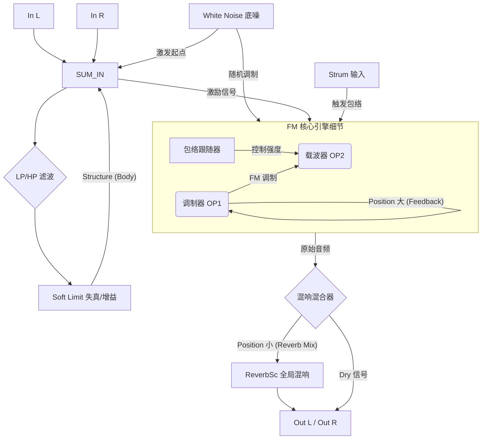

# RingsXaudreyII (Audrey A) 功能对照

**创建时间**: 2026年1月23日 19:16 (HOHO Noise 系列)

## 0. 模式顺序 (通过右侧按键循环)
RingsXaudreyII 扩展了原版模式组，总计提供 10 个可循环模式：

*   **模式 1-3 (索引 0-2)**: 原版基础模式 (Modal, Sympathetic String, String). (红/绿/橙)
*   **模式 4-6 (索引 3-5)**: 原版对应的扩展 FX 模式.
*   **模式 7 (索引 6)**: 原版 Easter Egg (内置). (白色)
*   **模式 8-10 (索引 7-9)**: **Audrey A 暴力模式组 (新增)**.
    *   **模式 8 (索引 7)**: Audrey A - FM 核心结构与反馈延迟。
    *   **模式 9 (索引 8)**: Audrey B - 带有更强的共振响应。
    *   **模式 10 (索引 9)**: Audrey C - 极端的非线性反馈。
    *   **视觉反馈**: 快速且细腻的彩色渐变灯 (速度比原版呼吸灯快一倍)。

## 1. 切换逻辑 (按键)
*   **短按右键**: 在 0-9 模式中按顺序循环切换。
*   **长按右键**: 快速类目跳转：
    *   当前 < 3 (原版组) -> 跳转到 3 (扩展组)。
    *   当前 3-5 (扩展组) -> 跳转到 6 (彩蛋模式)。
    *   当前 6 (彩蛋) -> 跳转到 7 (Audrey HOHO 模式)。
    *   当前 >= 7 (Audrey) -> 跳转到 0 (重回原版)。
*   **左键**: 控制复音数 (1/2/4)。注意：在 Audrey 模式下 (model >= 7)，复音锁定为单声部或特定行为以保持反馈稳定性。

## 2. 旋钮逻辑切换
- **模式 0-6 (原版)**: Position 小旋钮 = CV 衰减器 (无混响)。
- **模式 7-9 (Audrey A)**: Position 小旋钮 = 混合混响深度 (Position CV 为直接输入)。

- **Structure (对应 Body)**: 控制 FM 核心结构与反馈延迟的基础频率。
- **Brightness (对应 Nervousness)**: 控制调制的频率和不稳定性（频率偏移）。
- **Position 大旋钮 (对应 Tone)**: 控制反馈量 (Feedback)。
    - *左偏*: 相位反馈 (剧烈、尖锐)。
    - *右偏*: 调制器反馈 (深沉、失真)。
- **Damping (对应 Decay)**: 控制声振的时间长短。
- **Position 小旋钮**: 混响混合度 (Reverb Mix)。
- **White Noise 底噪**: 已加入恒定的白噪声注入。当反馈 (Position大) 调高时，模块即使不输入信号也会产生自激震荡，完美还原原版 Audrey 的行为。
- **MOD (FM) 输入**: 外部激励信号输入。
- **STRUM 输入**: 拨弦（触发包络）。

---

## 3. Audrey A (模式 7) 信号路由图

为了理解这款“暴力”固件是如何产生回授和噪音的，可以参考以下信号路径图：

### 路由逻辑解析：
1.  **激发起点**：我们加入的 **White Noise** 会始终注入到激励级。即使你不接任何输入，这颗火星也会在回授环路中被放大。
2.  **外部回授环路 (Outer Loop)**：`Structure (Body)` 控制的是一个包裹在 FM 引擎之外的反馈。它包含了 LP/HP 滤波和失真，能产生类似音箱回授的物理建模感。
3.  **FM 反馈 (Inner Loop)**：`Position 大 (Tone)` 控制的是 FM 调制器自身的相位反馈。向左拧产生尖锐的金属感，向右拧产生深沉的粗糙感。
4.  **最后关卡**：所有声音最后会流经 `ReverbSc` 混响单元，由 `Position 小` 旋钮控制混入多少空间感。

